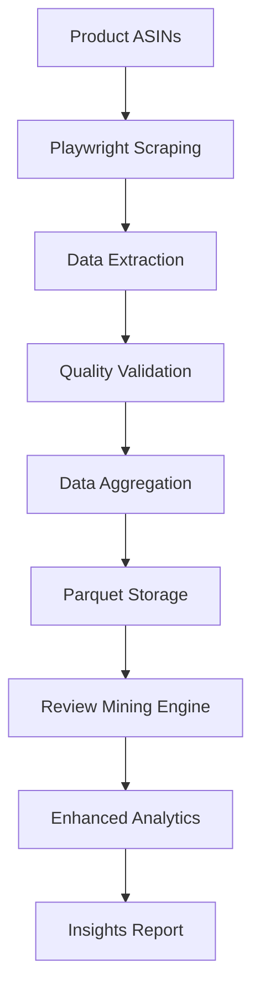

# 🚀 ETL Automation & Review Mining

A professional automation system for Amazon review ETL with advanced analytics and real-time monitoring.

## ✨ Features

### 🎯 **Core Capabilities**
- **Automated ETL Pipeline**: Extract Amazon reviews using Playwright with retry logic and error handling
- **Data Quality Validation**: Configurable quality checks with smart duplicate detection
- **Advanced Analytics**: Sentiment analysis, quality scoring, and product aspect extraction
- **Real-time Monitoring**: Live pipeline status, logs, and system metrics

### 📊 **Advanced Analytics**
- Sentiment analysis with polarity scoring
- Review quality assessment
- Product aspect mining (design, quality, price, etc.)
- Statistical insights and trend analysis

## 🚀 Quick Start

### 1. Setup Environment
```bash
# Windows
setup.bat

# Linux/Mac
├── ETL_automation.py          # ETL pipeline core
├── review_mining.py           # Advanced analytics engine
├── api_controller.py          # REST API for control
├── startup.py                 # Startup utility script
├── requirements.txt           # Python dependencies
├── setup.bat                  # Windows setup script
├── data/
│   ├── reviews/               # Raw review data (Parquet)
│   ├── processed/             # Processed data and insights
│   └── insights/              # JSON insight reports
├── ETL_env/                   # Python virtual environment
├── debug_screenshots/         # Debug artifacts
└── error_screenshots/         # Error debugging
```

## 🔧 Configuration

### Environment Variables
```bash
# Quality validation thresholds
ETL_MAX_NULL_PCT=0.5        # Maximum null percentage (50%)
ETL_MAX_DUP_PCT=0.6         # Maximum duplicate percentage (60%)
ETL_FORCE_LOAD_ON_NONZERO=1 # Force load on non-zero data
```

## 🛠️ Advanced Features

### ETL Pipeline
```python
# Run ETL with custom parameters
python ETL_automation.py --asins "B08N5WRWNW,B09BKG7333" --pages 3 --headless
```

### Data Processing
- **Smart Duplicate Detection**: Content and rating-based deduplication
- **Quality Scoring**: Multi-factor quality assessment
- **Sentiment Analysis**: VADER-based polarity and subjectivity
- **Aspect Mining**: Regex-based product feature extraction

### Monitoring & Debugging
- **Screenshot Capture**: Automatic error screenshots
- **Detailed Logging**: Navigation and error logs
- **Retry Logic**: Configurable retry attempts
- **Graceful Cleanup**: Guaranteed browser cleanup

## 📊 Data Pipeline



## 🚨 Troubleshooting

### Common Issues

**1. Pipeline Fails to Start**
- Check virtual environment activation
- Verify Playwright browser installation: `python -m playwright install`
- Ensure all dependencies are installed: `pip install -r requirements.txt`

**2. Browser Automation Errors**
- Run in non-headless mode for debugging
- Check screenshot artifacts in `debug_screenshots/`
- Review navigation logs in `debug_navigation.log`

**3. Data Quality Issues**
- Adjust quality thresholds via environment variables
- Review duplicate detection logic
- Check for Amazon anti-bot measures

### Debug Mode
Enable comprehensive debugging:
```python
# In ETL_automation.py
get_amazon_reviews(asin, debug=True, headless=False)
```

## 📈 Performance Optimization

### Recommended Settings
- **Concurrent Scraping**: Use ConcurrentTaskRunner for multiple products
- **Headless Mode**: Enable for production environments
- **Quality Thresholds**: Adjust based on data requirements
- **Retry Logic**: Configure based on network stability

### Scaling Considerations
- **Memory Usage**: Monitor for large datasets
- **Storage**: Use Parquet compression for efficiency
- **Browser Resources**: Limit concurrent browser instances
- **API Limits**: Respect Amazon's rate limiting

## 🔮 Future Enhancements

### Planned Features
- [ ] **Database Integration**: PostgreSQL/MongoDB support
- [ ] **API Endpoints**: RESTful API for external integration
- [ ] **Scheduled Runs**: Cron-based automation
- [ ] **Advanced ML**: Deep learning sentiment models
- [ ] **Export Options**: PDF reports and Excel exports
- [ ] **Cloud Deployment**: AWS/GCP deployment guides

### Potential Integrations
- [ ] **Slack/Teams**: Pipeline notifications
- [ ] **Email Alerts**: Error and completion notifications
- [ ] **Cloud Storage**: S3, GCS, Azure Blob integration
- [ ] **BI Tools**: Tableau, PowerBI connectors

## 📝 License

This project is for educational and research purposes. Please ensure compliance with Amazon's Terms of Service and robots.txt when scraping data.

## 🤝 Contributing

1. Fork the repository
2. Create a feature branch
3. Make your changes
4. Add tests if applicable
5. Submit a pull request

## 📞 Support

For issues, questions, or contributions:
- Create an issue in the repository
- Check the troubleshooting section
- Review the debug logs
